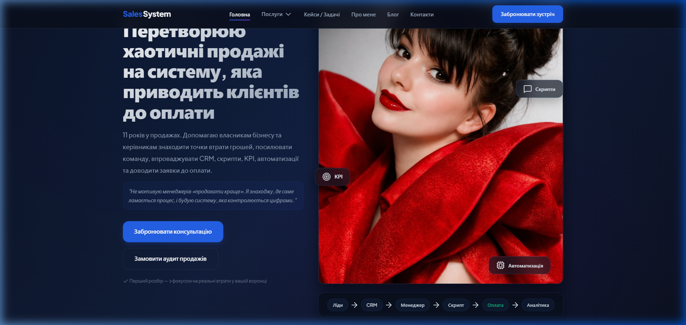
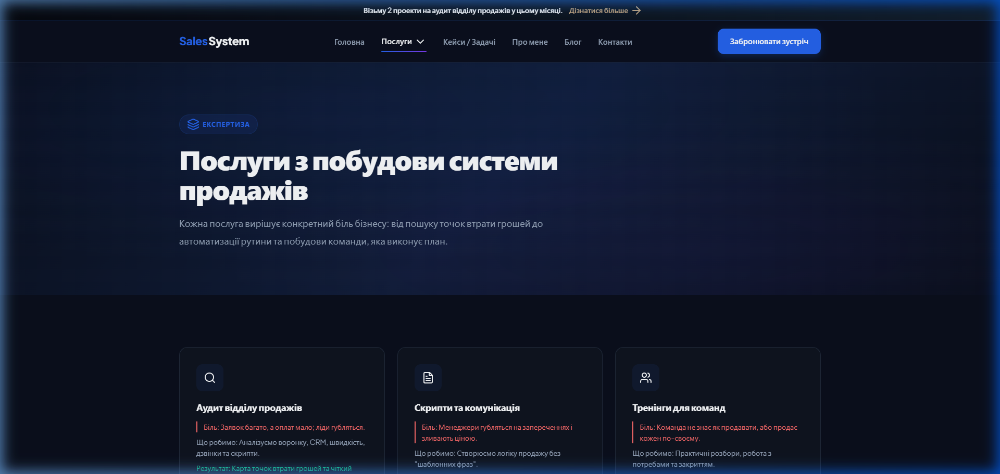
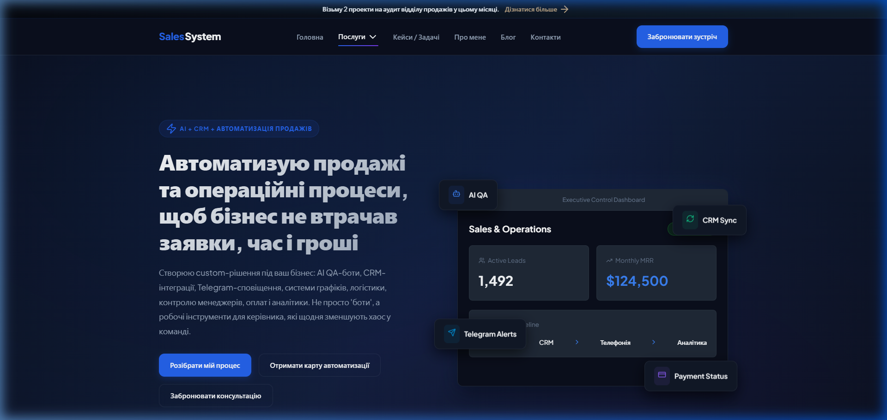
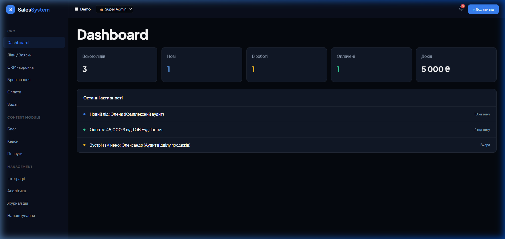

# SalesSystem AI Platform

SalesSystem — це pet-проєкт AI-assisted платформи для експерта з продажів, яка поєднує публічний сайт, сторінки послуг, бронювання консультацій, CRM/admin-логіку, статуси лідів, оплат, зустрічей та AI-автоматизацій.

## Live Demo

👉 **[https://firstwin-livid.vercel.app/](https://firstwin-livid.vercel.app/)**

---

## Про проєкт

Ідея проєкту виникла з реального досвіду в управлінні продажами, побудові відділів продажів, роботі з CRM, скриптами, контролем якості, аналітикою та автоматизацією процесів.

Мета була створити не просто сайт-візитку, а повноцінну digital-платформу, де потенційний клієнт може:

- Переглянути послуги та тарифні сітки;
- Зрозуміти експертизу консультанта;
- Пройти інтерактивну експрес-діагностику відділу продажів;
- Залишити заявку або забронювати консультацію;
- Обрати зручний формат роботи;
- Перейти до аудиту, скриптів, тренінгів або автоматизації;
- Побачити приклади AI-рішень та інтеграцій для бізнесу.

З боку адміністратора проєкт передбачає CRM/admin-логіку для обробки лідів, статусів, оплат, бронювань, UTM-міток і клієнтських запитів.

---

## Яку проблему вирішує

Багато бізнесів втрачають заявки та гроші не через поганий продукт, а через хаос у продажах:

- Заявки губляться між каналами;
- Менеджери не ведуть CRM або довго відповідають;
- Немає контролю повторних контактів;
- Немає прозорої воронки продажів;
- Керівник не бачит реальний статус клієнтів;
- Скрипти не працюють або викликають спротив команди;
- Дзвінки не аналізуються системно;
- Оплати та зустрічі контролюються вручну.

SalesSystem показує, як ці процеси можна перевести у цифрову систему з CRM-логікою, бронюванням, аналітикою та AI-автоматизацією.

---

## Що реалізовано

У проєкті реалізовано:

- **Публічний сайт експерта з продажів**: адаптивна посадочна сторінка з чітким позиціонуванням;
- **Інтерактивний Sales Diagnostic block**: кастомна чекліст-картка із динамічним підрахунком ризиків у реальному часі;
- **Сторінки послуг**: деталізовані лендінги (Аудит, Скрипти, Тренінги, CRM & Автоматизація, AI-рішення, Супровід);
- **Деталізація послуг та документів**: модальні вікна ознайомлення із переліком регламентів, скриптів та звітності;
- **Форма бронювання та замовлення**: розрахунок вартості, вибір формату та вибір платіжного шлюзу;
- **CRM/Admin панель**: ізольований layout із бічним меню, таблицями лідів, статусів, оплат, фільтрацією та аналітикою;
- **AI/Custom рішення**: концепт AI QA-бота для аналізу дзвінків та автоматизації комунікації.

---

## AI-assisted development

Проєкт створювався з використанням AI coding tools (Pair Programming & Code Generation).

**Моя роль у проєкті**:

- Сформулювала ідею та візію продукту;
- Описала бізнес-логіку та воронку продажів;
- Створювала технічні завдання (Prompt Engineering & Requirements Spec);
- Ітеративно перевіряла результат та тестувала користувацькі сценарії;
- Аналізувала UI/UX та вдосконалювала дизайн-систему;
- Формувала вимоги до CRM/admin-панелі та систем контролю;
- Описувала логіку AI-автоматизацій;
- Перевіряла безпеку та анонімізацію demo-даних;
- Ставила задачі на покращення дизайну, текстів, CTA та конверсійних елементів.

Для мене це був експеримент у тому, як людина з бізнес-досвідом може за допомогою AI-інструментів швидко перетворити ідею в робочий digital-продукт.

---

## Основні можливості

### 1. Публічна частина
- Опис експерта та позиціонування;
- Інтерактивна експрес-діагностика відділу продажів з розрахунком рівнів ризику;
- Опис послуг: Аудит, Скрипти, Тренінги, CRM & Автоматизація, AI-рішення;
- Модальні вікна з переліком документів (ексель-звіти, скрипти, регламенти);
- Калькулятор та вибір тарифів (Старт / Оптимальний / Повний супровід);
- Блоки довіри, кейси, блог та контакти.

### 2. CRM/Admin логіка
- Список та картки лідів;
- CRM-статуси (Новий, В роботі, Оплачено, Скасовано);
- Відстеження джерел та UTM-міток;
- Календар та бронювання зустрічей;
- Базова аналітика (дохід, кількість лідів, конверсія);
- Управління послугами, блогом та налаштуваннями.

### 3. AI/Automation концепція
- AI QA-бот для аналізу розмов менеджерів з клієнтами;
- Автоматичний контроль дотримання скриптів;
- Інтеграції з Telegram-ботом сповіщень;
- CRM-автоматизації та нагадування про повторний контакт;
- Інтеграції з платіжними системами (mono, LiqPay, WayForPay, Whitepay).

---

## Screenshots

### Home Page


### Services & Pricing


### AI Automation


### Admin Dashboard


---

## Tech Stack

- **Frontend Core**: HTML5, Modern Vanilla JavaScript (ES6 Modules)
- **Architecture**: Single Page Application (SPA) with Hash Router
- **Styling**: Vanilla CSS3 (Custom Design System, CSS Variables, Glassmorphism, Responsive Grid)
- **Icons**: Lucide Icons
- **Hosting & CI/CD**: Vercel
- **Development Workflow**: AI-assisted development

---

## Project Structure

```txt
sales-system-ai-platform/
├── css/
│   ├── components.css        # Компоненти, діагностика, модалки, картки
│   ├── main.css              # Базові стилі, змінні, типографіка
│   └── pages.css             # Стилі конкретних сторінок
├── docs/
│   └── screenshots/          # Скріншоти проєкту для документації
│       ├── admin-dashboard.png
│       ├── ai-automation.png
│       ├── home.png
│       └── services.png
├── img/
│   └── expert.jpg            # Фото експерта
├── js/
│   ├── components/
│   │   ├── chat.js           # Віджет онлайн-чату / AI-помічника
│   │   ├── modal.js          # Модальні вікна (ознайомлення з документами)
│   │   ├── navbar.js         # Навігація та шапка сайту
│   │   └── payment.js        # Платіжні модальні вікна
│   ├── pages/
│   │   ├── about.js          # Сторінка "Про мене"
│   │   ├── admin.js          # Адмін-панель та CRM-панель
│   │   ├── ai-solutions.js   # Сторінка AI-рішень
│   │   ├── audit.js          # Аудит відділу продажів
│   │   ├── blog.js           # Блог
│   │   ├── cases.js          # Кейси та розбори
│   │   ├── consultation.js   # Запис на консультацію
│   │   ├── contacts.js       # Контакти
│   │   ├── error.js          # 404 сторінка
│   │   ├── home.js           # Головна сторінка & Sales Diagnostic
│   │   ├── scripts.js        # Скрипти продажів
│   │   ├── services.js       # Каталог послуг
│   │   ├── status.js         # Перевірка статусу заявки
│   │   ├── success.js        # Дякуємо за заявку
│   │   ├── support.js        # Повний супровід ВП
│   │   ├── terms.js          # Політика конфіденційності
│   │   └── trainings.js      # Тренінги команд
│   ├── app.js                # Точка входу додатка
│   ├── router.js             # SPA роутер
│   └── state.js              # Управління станом та демо-даними
├── .env.example              # Шаблон змінних оточення
├── .gitignore                # Файл виключень Git
├── index.html                # Основний HTML шаблон
├── LICENSE                   # MIT Ліцензія
├── package.json              # Конфігурація проєкту
├── PROJECT_NOTES.md          # Нотатки для рекрутера / анкет
├── README.md                 # Документація проєкту
└── server.ps1                # Локальний локальний PowerShell сервер
```

---

## Як запустити локально

1. **Клонувати репозиторій**:
   ```bash
   git clone https://github.com/Anastasiia-als/sales-system-ai-platform.git
   ```

2. **Перейти в папку проєкту**:
   ```bash
   cd sales-system-ai-platform
   ```

3. **Створити `.env` на основі шаблону**:
   ```bash
   cp .env.example .env
   ```

4. **Запустити локальний сервер**:
   - На Windows (через PowerShell):
     ```powershell
     .\server.ps1
     ```
   - Або через Node.js / serve:
     ```bash
     npx serve -s . -p 3000
     ```

5. **Відкрити у браузері**:
   `http://localhost:3000`

---

## Environment Variables

Приклад конфігурації знаходиться у файлі `.env.example`.
Реальні ключі, токени та паролі не зберігаються у відкритому репозиторії.

---

## Roadmap

- [ ] Підключення реальної бази даних (PostgreSQL / Supabase);
- [ ] Інтеграція з Google Calendar API для автоматичного вибору вільних слотів;
- [ ] Оплати через моно-еквайринг та LiqPay API;
- [ ] Telegram Bot для миттєвих сповіщень про нові ліди;
- [ ] Рольова модель доступу (SuperAdmin / Manager / Viewer);
- [ ] AI-модуль транскрибації та аналізу дзвінків на базі OpenAI / Whisper;
- [ ] Автоматичний експорт лідів у Google Sheets.

---

## Статус проєкту

Проєкт знаходиться в активній розробці та демонстрації MVP-концепції.

---

## Автор

**Анастасія Запорожець**
Sales / CRM / AI Automation enthusiast

- Demo: [https://firstwin-livid.vercel.app/](https://firstwin-livid.vercel.app/)

---

## English Summary

**SalesSystem** is an AI-assisted pet project that combines a public consulting platform, interactive diagnostic tool, service pages, booking flow, CRM/admin logic, lead statuses, payment statuses, and AI automation concepts.

The project was created as an experiment in turning real-world sales operations experience into a working digital product using AI coding tools.

It demonstrates product thinking, business process modeling, CRM architecture, UI/UX refinement, and an AI-assisted development workflow.
