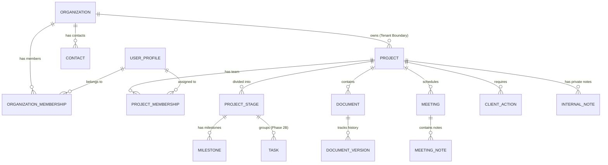

# Client & Project Delivery Platform — Data Schema & Security Model

> **Module**: Client & Project Delivery Platform (Client Portal)  
> **Backend Target**: Live PostgreSQL / Supabase (`firstwin-platform` in `eu-central-1`)  
> **Status**: Deployed & RLS Verified (Phases 0.1A, 0.1B, 1A, 1B, 2A)  
> **Last Updated**: 2026-08-22  

---

## 1. Концептуальна модель даних (Entity-Relationship Overview)

---

## 2. Створені таблиці в Live Supabase

### 2.1 `profiles` (Профіль користувача)
- Зв'язаний 1-до-1 із `auth.users` через `id REFERENCES auth.users(id) ON DELETE CASCADE`.
- Поля: `id (UUID PK)`, `email`, `full_name`, `avatar_url`, `phone`, `telegram`, `global_role (owner, pm, specialist, client)`, `created_at`, `updated_at`.
- Тригер `on_auth_user_created` безпечно створює профіль із роллю за замовчуванням `client`.
- Тригер `prevent_role_escalation` блокує несанкціоновану зміну `global_role`.
- **Перший Owner**: `anzaitseva96@gmail.com` призначено з `global_role = 'owner'`.

### 2.2 `organizations` (Клієнти / Tenant Boundary)
- Первинна межа ізоляції даних та картка клієнта.
- Міграції: `20260822000001_phase0_1a_foundation.sql`, `20260822000002_contacts_schema.sql`.
- Поля: `id (UUID PK)`, `name`, `slug`, `legal_name`, `website`, `industry`, `country`, `timezone`, `status (active, paused, completed, archived, on_hold)`, `responsible_pm_id (FK profiles)`, `notes`, `lead_id`, `created_at`, `updated_at`.

### 2.3 `contacts` (Контактні особи організації)
- Контактні особи клієнта (не є Auth користувачами автоматично).
- Міграція: `20260822000002_contacts_schema.sql`.
- Поля: `id (UUID PK)`, `organization_id (UUID FK)`, `first_name`, `last_name`, `position`, `email`, `phone`, `telegram`, `is_primary (boolean)`, `is_decision_maker (boolean)`, `is_technical_contact (boolean)`, `notes`, `created_at`, `updated_at`.
- RLS: доступ регламентується членством в організації або роллю `owner`.

### 2.4 `organization_memberships` (Зв'язок User $\longleftrightarrow$ Organization)
- Регламентує доступ до конкретної організації.
- Поля: `id (UUID PK)`, `organization_id (UUID FK)`, `user_id (UUID FK)`, `org_role (owner, admin, pm, member, client)`, `is_active (boolean)`, `created_at`, `updated_at`.
- Обмеження: `UNIQUE(organization_id, user_id)`.

### 2.5 `projects` (Проєкт делівері)
- Центральна одиниця виконання зобов'язань (прив'язана до `organization_id`).
- Міграції: `20260822000001_phase0_1a_foundation.sql`, `20260822000003_projects_memberships_schema.sql`.
- Поля:
  - `id (UUID PK)`
  - `organization_id (UUID FK organizations ON DELETE CASCADE)`
  - `name (TEXT)` та `title (TEXT)` (двосторонньо синхронізуються тригером `handle_project_field_sync`)
  - `description (TEXT)`
  - `project_type (TEXT DEFAULT 'custom')` (`audit_sales`, `crm_implementation`, `scripts_kpi`, `sales_training`, `ai_automation`, `custom`)
  - `status (TEXT DEFAULT 'draft')` (`draft`, `onboarding`, `discovery`, `in_progress`, `waiting_client`, `blocked`, `client_review`, `completed`, `paused`, `archived`)
  - `health (TEXT DEFAULT 'on_track')` та `health_status (TEXT)` (`on_track`, `at_risk`, `delayed`)
  - `progress_percent (INTEGER DEFAULT 0)`
  - `start_date (DATE)`
  - `target_date (DATE)` та `target_end_date (DATE)`
  - `responsible_pm_id (UUID FK profiles ON DELETE SET NULL)`
  - `created_at (TIMESTAMPTZ DEFAULT NOW())`
  - `updated_at (TIMESTAMPTZ DEFAULT NOW())`

### 2.6 `project_memberships` (Зв'язок User $\longleftrightarrow$ Project)
- Призначення команди спеціалістів та клієнтських представників на конкретні проєкти.
- Міграція: `20260822000003_projects_memberships_schema.sql`.
- Поля: `id (UUID PK)`, `project_id (UUID FK)`, `user_id (UUID FK)`, `project_role (pm, admin, lead_consultant, specialist, it_specialist, member, client_rep)`, `created_at`.
- Обмеження: `UNIQUE(project_id, user_id)`.

### 2.7 `project_stages` (Етапи делівері проєкту / Roadmap)
- Послідовні етапи виконання робіт проєкту.
- Міграція: `20260822000004_roadmap_stages_milestones.sql`.
- Поля:
  - `id (UUID PK)`
  - `project_id (UUID FK projects ON DELETE CASCADE)`
  - `organization_id (UUID FK organizations ON DELETE CASCADE)`
  - `name (TEXT NOT NULL)`
  - `description (TEXT)`
  - `status (TEXT NOT NULL DEFAULT 'not_started')` (`not_started`, `in_progress`, `waiting_client`, `blocked`, `completed`)
  - `sort_order (INTEGER NOT NULL DEFAULT 0)`
  - `responsible_user_id (UUID FK profiles ON DELETE SET NULL)`
  - `start_date (DATE)`
  - `target_date (DATE)`
  - `is_client_visible (BOOLEAN NOT NULL DEFAULT TRUE)`
  - `created_at (TIMESTAMPTZ DEFAULT NOW())`
  - `updated_at (TIMESTAMPTZ DEFAULT NOW())`

### 2.8 `milestones` (Контрольні точки етапів делівері)
- Ключові результати всередині етапу.
- Міграція: `20260822000004_roadmap_stages_milestones.sql`.
- Поля:
  - `id (UUID PK)`
  - `organization_id (UUID FK organizations ON DELETE CASCADE)`
  - `project_id (UUID FK projects ON DELETE CASCADE)`
  - `stage_id (UUID FK project_stages ON DELETE CASCADE)`
  - `name (TEXT NOT NULL)`
  - `description (TEXT)`
  - `target_date (DATE)`
  - `status (TEXT NOT NULL DEFAULT 'pending')` (`pending`, `completed`)
  - `completed_at (TIMESTAMPTZ)` (автоматично керується тригером `handle_milestone_completion_time`)
  - `is_client_visible (BOOLEAN NOT NULL DEFAULT TRUE)`
  - `sort_order (INTEGER NOT NULL DEFAULT 0)`
  - `created_at (TIMESTAMPTZ DEFAULT NOW())`
  - `updated_at (TIMESTAMPTZ DEFAULT NOW())`

### 2.9 `tasks` (Задачі делівері та Client Actions)
- Базова операційна сутність для внутрішніх задач команди та дій клієнта.
- Міграція: `20260822000005_tasks_dependencies_actions.sql`.
- Поля:
  - `id (UUID PK)`
  - `organization_id (UUID FK organizations ON DELETE CASCADE)`
  - `project_id (UUID FK projects ON DELETE CASCADE)`
  - `stage_id (UUID FK project_stages ON DELETE SET NULL)`
  - `milestone_id (UUID FK milestones ON DELETE SET NULL)`
  - `title (TEXT NOT NULL)`
  - `description (TEXT)`
  - `status (TEXT NOT NULL DEFAULT 'backlog')` (`backlog`, `todo`, `in_progress`, `review`, `waiting_client`, `blocked`, `done`)
  - `priority (TEXT NOT NULL DEFAULT 'medium')` (`low`, `medium`, `high`, `critical`)
  - `assignee_user_id (UUID FK profiles ON DELETE SET NULL)`
  - `responsibility_type (TEXT NOT NULL DEFAULT 'internal')` (`internal`, `client`)
  - `client_contact_id (UUID FK contacts ON DELETE SET NULL)`
  - `start_date (DATE)`
  - `due_date (DATE)`
  - `completed_at (TIMESTAMPTZ)` (автоматично керується тригером `handle_task_completion_time`)
  - `is_client_visible (BOOLEAN NOT NULL DEFAULT FALSE)` (примусово `TRUE` для `responsibility_type = 'client'`)
  - `created_by (UUID FK profiles ON DELETE SET NULL)`
  - `sort_order (INTEGER NOT NULL DEFAULT 0)`
  - `created_at (TIMESTAMPTZ DEFAULT NOW())`
  - `updated_at (TIMESTAMPTZ DEFAULT NOW())`

### 2.10 `task_dependencies` (Залежності між задачами)
- Зв'язок "Задача A залежить від Задачі B".
- Міграція: `20260822000005_tasks_dependencies_actions.sql`.
- Поля:
  - `id (UUID PK)`
  - `organization_id (UUID FK organizations ON DELETE CASCADE)`
  - `project_id (UUID FK projects ON DELETE CASCADE)`
  - `task_id (UUID FK tasks ON DELETE CASCADE)`
  - `depends_on_task_id (UUID FK tasks ON DELETE CASCADE)`
  - `created_at (TIMESTAMPTZ DEFAULT NOW())`
- Обмеження: `UNIQUE(task_id, depends_on_task_id)`, `CHECK(task_id <> depends_on_task_id)`.
- Захист від циклічності: тригер `validate_task_dependency` з рекурсивним CTE.

### 2.11 `documents` (Документи та артефакти проєкту)
- Центральний реєстр проєктних документів (Phase 3A).
- Міграція: `20260822000007_documents_storage_versioning.sql`.
- Поля:
  - `id (UUID PK)`
  - `organization_id (UUID FK organizations ON DELETE CASCADE)`
  - `project_id (UUID FK projects ON DELETE CASCADE)`
  - `stage_id (UUID FK project_stages ON DELETE SET NULL)`
  - `title (TEXT NOT NULL)`
  - `description (TEXT)`
  - `category (TEXT NOT NULL)` (Аудит, Стратегія, Sales Playbook, Скрипти, Регламент / SOP, Звіт, Аналітика, Технічне завдання, Навчальні матеріали, Матеріали зустрічі, Фінальний результат, Інше)
  - `status (TEXT NOT NULL DEFAULT 'draft')` (`draft`, `internal_review`, `client_review`, `changes_requested`, `approved`, `final`)
  - `owner_user_id (UUID FK profiles ON DELETE SET NULL)`
  - `internal_access_scope (TEXT NOT NULL DEFAULT 'project_team')` (`management`, `project_team`)
  - `is_client_visible (BOOLEAN NOT NULL DEFAULT FALSE)` (примусово `FALSE` для `management`)
  - `created_by (UUID FK profiles ON DELETE SET NULL)`
  - `created_at (TIMESTAMPTZ DEFAULT NOW())`
  - `updated_at (TIMESTAMPTZ DEFAULT NOW())`
  - `archived_at (TIMESTAMPTZ)`

### 2.12 `document_versions` (Історія версій документів)
- Незмінні версії бінарних файлів документів (Phase 3A).
- Міграція: `20260822000007_documents_storage_versioning.sql`.
- Поля:
  - `id (UUID PK)`
  - `document_id (UUID FK documents ON DELETE CASCADE)`
  - `organization_id (UUID FK organizations ON DELETE CASCADE)`
  - `project_id (UUID FK projects ON DELETE CASCADE)`
  - `version_number (INTEGER NOT NULL)`
  - `storage_path (TEXT NOT NULL)`
  - `original_filename (TEXT NOT NULL)`
  - `mime_type (TEXT)`
  - `size_bytes (BIGINT)`
  - `uploaded_by (UUID FK profiles ON DELETE SET NULL)`
  - `change_note (TEXT)`
  - `created_at (TIMESTAMPTZ DEFAULT NOW())`
- Обмеження: `UNIQUE(document_id, version_number)`.

### 2.13 Supabase Private Storage Bucket `project-documents`
- Приватний бакет для збереження реальних файлів документів (не публічний, ліміт 50 МБ).
- Структура шляху: `{organization_id}/{project_id}/{document_id}/v{version_number}_{filename}`.
- Доступ регламентується RLS-політиками `storage.objects` та Signed URLs.

### 2.14 `meeting_series` (Серії повторюваних зустрічей)
- Шаблони регулярних синхронізацій (Phase 3B).
- Міграція: `20260822000008_meetings_recurring_notes_decisions.sql`.
- Поля: `id (UUID PK)`, `organization_id (UUID FK)`, `project_id (UUID FK)`, `title (TEXT NOT NULL)`, `description (TEXT)`, `meeting_type (TEXT)`, `frequency (TEXT NOT NULL)` (`weekly`, `biweekly`, `monthly`, `custom`), `interval (INTEGER)`, `days_of_week (INTEGER[])`, `start_time (TIME)`, `duration_minutes (INTEGER)`, `timezone (TEXT)`, `location_type (TEXT)`, `meeting_url (TEXT)`, `location_text (TEXT)`, `start_date (DATE)`, `end_date (DATE)`, `is_active (BOOLEAN)`, `created_by (UUID FK)`, `created_at`, `updated_at`.

### 2.15 `meetings` (Зустрічі делівері)
- Одиничні зустрічі та згенеровані екземпляри серій (Phase 3B).
- Міграція: `20260822000008_meetings_recurring_notes_decisions.sql`.
- Поля: `id (UUID PK)`, `organization_id (UUID FK)`, `project_id (UUID FK)`, `recurrence_series_id (UUID FK meeting_series ON DELETE SET NULL)`, `title (TEXT NOT NULL)`, `description (TEXT)`, `meeting_type (TEXT NOT NULL)` (`kickoff`, `weekly_sync`, `demo`, `planning`, `technical`, `retrospective`, `other`), `status (TEXT NOT NULL DEFAULT 'scheduled')` (`scheduled`, `in_progress`, `completed`, `cancelled`, `rescheduled`), `start_at (TIMESTAMPTZ NOT NULL)`, `end_at (TIMESTAMPTZ NOT NULL)`, `timezone (TEXT NOT NULL DEFAULT 'Europe/Kyiv')`, `location_type (TEXT NOT NULL DEFAULT 'online')` (`online`, `offline`, `hybrid`), `meeting_url (TEXT)`, `location_text (TEXT)`, `recording_url (TEXT)`, `agenda (TEXT)`, `organizer_user_id (UUID FK profiles)`, `is_client_visible (BOOLEAN NOT NULL DEFAULT TRUE)`, `created_by (UUID FK)`, `created_at`, `updated_at`.

### 2.16 `meeting_participants` (Учасники зустрічі)
- Склад учасників із розділенням internal staff (`user_id`) та client contacts (`contact_id`) (Phase 3B).
- Міграція: `20260822000008_meetings_recurring_notes_decisions.sql`.
- Поля: `id (UUID PK)`, `meeting_id (UUID FK meetings ON DELETE CASCADE)`, `organization_id (UUID FK)`, `project_id (UUID FK)`, `participant_type (TEXT NOT NULL)` (`user`, `contact`), `user_id (UUID FK profiles)`, `contact_id (UUID FK contacts)`, `attendance_status (TEXT NOT NULL DEFAULT 'invited')` (`invited`, `confirmed`, `attended`, `declined`, `no_show`), `notes (TEXT)`, `created_at`, `updated_at`.
- Обмеження: `CHECK ((participant_type = 'user' AND user_id IS NOT NULL AND contact_id IS NULL) OR (participant_type = 'contact' AND contact_id IS NOT NULL AND user_id IS NULL))`, `UNIQUE (meeting_id, user_id)` та `UNIQUE (meeting_id, contact_id)`.

### 2.17 `meeting_notes` (Нотатки та протоколи зустрічей)
- Фіксація ходу обговорення (Phase 3B).
- Міграція: `20260822000008_meetings_recurring_notes_decisions.sql`.
- Поля: `id (UUID PK)`, `meeting_id (UUID FK meetings ON DELETE CASCADE)`, `organization_id (UUID FK)`, `project_id (UUID FK)`, `note_type (TEXT NOT NULL DEFAULT 'general')` (`general`, `agenda_item`, `internal`, `summary`), `body (TEXT NOT NULL)`, `is_client_visible (BOOLEAN NOT NULL DEFAULT TRUE)` (примусово `FALSE` для `note_type = 'internal'`), `sort_order (INTEGER)`, `created_by (UUID FK)`, `created_at`, `updated_at`.

### 2.18 `meeting_decisions` (Зафіксовані рішення)
- Офіційні домовленості зустрічі (Phase 3B).
- Міграція: `20260822000008_meetings_recurring_notes_decisions.sql`.
- Поля: `id (UUID PK)`, `meeting_id (UUID FK meetings ON DELETE CASCADE)`, `organization_id (UUID FK)`, `project_id (UUID FK)`, `decision_text (TEXT NOT NULL)`, `is_client_visible (BOOLEAN NOT NULL DEFAULT TRUE)`, `sort_order (INTEGER)`, `created_by (UUID FK)`, `created_at`, `updated_at`.

### 2.19 `meeting_documents` (Прикріплені матеріали зустрічі)
- Зв'язок зустрічей із проєктними документами (Phase 3B).
- Міграція: `20260822000008_meetings_recurring_notes_decisions.sql`.
- Поля: `id (UUID PK)`, `meeting_id (UUID FK meetings ON DELETE CASCADE)`, `document_id (UUID FK documents ON DELETE CASCADE)`, `organization_id (UUID FK)`, `project_id (UUID FK)`, `relation_type (TEXT NOT NULL DEFAULT 'agenda_material')` (`agenda_material`, `protocol_attachment`, `follow_up`), `created_at`.
- Обмеження: `UNIQUE (meeting_id, document_id)`.

### 2.20 `client_portal_access` (Управління доступом клієнтів)
- Мапінг контактних осіб на облікові записи автентифікації та статус доступу (Phase 4A).
- Міграція: `20260823000009_client_portal_access_rls.sql`.
- Поля: `id (UUID PK)`, `organization_id (UUID FK organizations ON DELETE CASCADE)`, `contact_id (UUID FK contacts ON DELETE CASCADE)`, `user_id (UUID FK auth.users ON DELETE SET NULL)`, `status (TEXT NOT NULL DEFAULT 'invited')` (`invited`, `active`, `revoked`), `invited_at (TIMESTAMPTZ NOT NULL DEFAULT NOW())`, `invited_by (UUID FK profiles ON DELETE SET NULL)`, `activated_at (TIMESTAMPTZ)`, `revoked_at (TIMESTAMPTZ)`, `revoked_by (UUID FK profiles ON DELETE SET NULL)`, `created_at`, `updated_at`.
- Обмеження: `UNIQUE (organization_id, contact_id) WHERE status IN ('active', 'invited')`.

### 2.21 `document_review_events` (Незмінний аудит погоджень та правок клієнта)
- Хронологія рішень клієнта щодо конкретних версій документів (Phase 4B).
- Міграція: `20260823000010_client_workspace_phase4b.sql`.
- Поля:
  - `id (UUID PK)`
  - `document_id (UUID FK documents ON DELETE CASCADE)`
  - `document_version_id (UUID FK document_versions ON DELETE CASCADE)`
  - `organization_id (UUID FK organizations ON DELETE CASCADE)`
  - `project_id (UUID FK projects ON DELETE CASCADE)`
  - `reviewer_user_id (UUID FK auth.users ON DELETE SET NULL)`
  - `reviewer_contact_id (UUID FK contacts ON DELETE SET NULL)`
  - `action (TEXT NOT NULL)` (`approved`, `changes_requested`, `viewed`)
  - `comment (TEXT)` (обов'язковий при `action = 'changes_requested'`)
  - `created_at (TIMESTAMPTZ NOT NULL DEFAULT NOW())`
- Правила незмінності: заборонено UPDATE та DELETE (тільки INSERT).

### 2.22 `notifications` (Персональні сповіщення та проактивний контроль)
- Персональний інбокс оперативних сповіщень внутрішніх користувачів (Phase 5B).
- Міграція: `20260824000011_notifications_personal_inbox_phase5b.sql`.
- Поля:
  - `id (UUID PK)`
  - `recipient_user_id (UUID NOT NULL FK auth.users ON DELETE CASCADE)`
  - `actor_user_id (UUID FK auth.users ON DELETE SET NULL)`
  - `organization_id (UUID FK organizations ON DELETE CASCADE)`
  - `project_id (UUID FK projects ON DELETE CASCADE)`
  - `event_type (TEXT NOT NULL)` (словник подій: `task_assigned`, `task_due_soon`, `task_overdue`, `task_priority_critical`, `client_action_due_soon`, `client_action_overdue`, `client_action_completed`, `document_approved`, `document_changes_requested`, `meeting_starting_soon`, `project_health_changed`, `responsibility_assigned`, тощо)
  - `severity (TEXT NOT NULL CHECK IN ('info', 'success', 'warning', 'critical'))`
  - `title (TEXT NOT NULL)`
  - `message (TEXT NOT NULL)`
  - `entity_type (TEXT)` (`task`, `document`, `meeting`, `project`, `client_action`, `organization`)
  - `entity_id (UUID)`
  - `deep_link (TEXT NOT NULL)`
  - `is_read (BOOLEAN NOT NULL DEFAULT FALSE)`
  - `read_at (TIMESTAMPTZ)`
  - `dedupe_key (TEXT UNIQUE)` (детермінована дедуплікація повторних алертерів)
  - `expires_at (TIMESTAMPTZ)`
  - `metadata (JSONB NOT NULL DEFAULT '{}'::jsonb)`
  - `created_at (TIMESTAMPTZ NOT NULL DEFAULT NOW())`
- Індекси: `(recipient_user_id, is_read, created_at DESC)`, `(recipient_user_id, severity)`, `dedupe_key`.
- RLS & Mutation Hardening (Phase 5B.1): `recipient_user_id = auth.uid()` для SELECT та UPDATE.
- Тригер `prevent_notification_unauthorized_modifications()` блокує зміну будь-яких полів крім `is_read` та `read_at`. Спроба змінити `title`, `message`, `severity`, `event_type`, `recipient_user_id`, `dedupe_key`, `deep_link` тощо викликає SQL-виняток. Прямий `INSERT` / `DELETE` клієнтом заблоковано.

### 2.23 `project_commercial_terms` (Комерційні умови проєкту)
- Актуальні комерційні умови та параметри контракту (Phase 5C.1).
- Поля: `id (UUID PK)`, `organization_id (UUID FK organizations)`, `project_id (UUID UNIQUE FK projects)`, `currency (TEXT NOT NULL DEFAULT 'CZK')`, `contract_value_minor (BIGINT NOT NULL DEFAULT 0)`, `commercial_model (TEXT NOT NULL)` (`fixed_fee`, `retainer`, `milestone_based`, `hourly`, `custom`), `contract_status (TEXT NOT NULL)` (`draft`, `proposed`, `active`, `completed`, `cancelled`), `contract_number (TEXT)`, `contract_date (DATE)`, `contract_document_id (UUID FK documents)`, `payment_terms_text (TEXT)`, `notes (TEXT)`, `created_by (UUID FK auth.users)`, `created_at (TIMESTAMPTZ)`, `updated_at (TIMESTAMPTZ)`.
- RLS: Owner та PM/Admin організації мають доступ на читання та запис. Specialist та Client — Default Deny.

### 2.24 `project_payment_schedule` (Графік оплат / Транші)
- Планові етапи фінансування та контроль строків оплат (Phase 5C.1).
- Поля: `id (UUID PK)`, `organization_id (UUID FK organizations)`, `project_id (UUID FK projects)`, `commercial_terms_id (UUID FK project_commercial_terms)`, `title (TEXT NOT NULL)`, `amount_minor (BIGINT NOT NULL > 0)`, `currency (TEXT NOT NULL)`, `due_date (DATE NOT NULL)`, `status (TEXT NOT NULL)` (`planned`, `due`, `partially_paid`, `paid`, `overdue`, `cancelled`), `notes (TEXT)`, `sort_order (INTEGER NOT NULL DEFAULT 0)`, `created_by (UUID FK auth.users)`, `created_at (TIMESTAMPTZ)`, `updated_at (TIMESTAMPTZ)`.
- RLS: Owner та PM/Admin організації мають доступ. Specialist та Client — Default Deny.

### 2.25 `project_payments` (Фактично отримані платежі)
- Історія зарахованих платежів від клієнтів (Phase 5C.1).
- Поля: `id (UUID PK)`, `organization_id (UUID FK organizations)`, `project_id (UUID FK projects)`, `payment_schedule_id (UUID FK project_payment_schedule)`, `amount_minor (BIGINT NOT NULL > 0)`, `currency (TEXT NOT NULL)`, `paid_at (TIMESTAMPTZ NOT NULL DEFAULT NOW())`, `payment_method (TEXT NOT NULL)` (`bank_transfer`, `card`, `cash`, `crypto`, `other`), `reference (TEXT)`, `comment (TEXT)`, `created_by (UUID FK auth.users)`, `created_at (TIMESTAMPTZ)`.
- Тригер `handle_payment_mutation()`: автоматично перераховує стан пов'язаного траншу (`paid`, `partially_paid`, `overdue`, `planned`), блокує overpayment без розлінкування, генерує подію в `finance_audit_events` та відправляє сповіщення `payment_received` для Owner та PM.
- RLS: Owner та PM/Admin організації. Specialist та Client — Default Deny.

### 2.26 `project_costs` (Внутрішні витрати FIRSTWIN — Owner Only)
- Планові та фактичні витрати компанії на реалізацію проєкту (Phase 5C.1).
- Поля: `id (UUID PK)`, `organization_id (UUID FK organizations)`, `project_id (UUID FK projects)`, `category (TEXT NOT NULL)` (`specialist`, `software`, `contractor`, `marketing`, `travel`, `infrastructure`, `other`), `title (TEXT NOT NULL)`, `amount_minor (BIGINT NOT NULL > 0)`, `currency (TEXT NOT NULL)`, `cost_type (TEXT NOT NULL)` (`planned`, `actual`), `status (TEXT NOT NULL)` (`planned`, `approved`, `incurred`, `paid`, `cancelled`), `incurred_at (DATE)`, `vendor_or_recipient (TEXT)`, `notes (TEXT)`, `created_by (UUID FK auth.users)`, `created_at (TIMESTAMPTZ)`, `updated_at (TIMESTAMPTZ)`.
- RLS: **Строго Owner Only (`is_global_owner()`)**. PM, Specialist, Client отримують 0 рядків.

### 2.27 `finance_audit_events` (Append-Only Фінансовий аудит)
- Незмінний журнал фінансових операцій (Phase 5C.1).
- Поля: `id (UUID PK)`, `organization_id (UUID FK organizations)`, `project_id (UUID FK projects)`, `entity_type (TEXT NOT NULL)` (`commercial_terms`, `payment_schedule`, `payment`, `cost`), `entity_id (UUID NOT NULL)`, `action (TEXT NOT NULL)` (`created`, `updated`, `cancelled`, `payment_recorded`, `deleted`), `actor_user_id (UUID FK auth.users)`, `old_values (JSONB)`, `new_values (JSONB)`, `metadata (JSONB)`, `created_at (TIMESTAMPTZ NOT NULL DEFAULT NOW())`.
- Тригер `prevent_finance_audit_tampering()` блокує будь-які спроби `UPDATE` або `DELETE` (`ERRCODE 42501`).

---

## 3. Захищені функції безпеки (`SECURITY DEFINER` + `search_path`)

- `public.validate_finance_project_org_consistency()` — перевіряє прив'язку `project_id` до `organization_id` у всіх фінансових таблицях.
- `public.validate_payment_consistency()` — гарантує відповідність проєкту та валюти платежу до пов'язаного планового траншу.
- `public.validate_commercial_terms_consistency()` — валідує належність прикріпленого документа договору до того ж проєкту.
- `public.handle_payment_mutation()` — перераховує статус траншу, перевіряє ліміти оплат, логує аудит і відправляє нотифікації.
- `public.prevent_finance_audit_tampering()` — блокує будь-які модифікації або видалення з фінансового аудит-логу.

- `public.prevent_notification_unauthorized_modifications()` — тригер суворого захисту незмінних полів сповіщень. Забезпечує, що користувачі можуть змінювати виключно статус прочитання (`is_read`, `read_at`) у власних сповіщеннях, і автоматично синхронізує час прочитання.

- `public.create_internal_notification(...)` (RPC/Helper) — безпечно створює сповіщення для внутрішнього користувача з обробкою `dedupe_key` та валідацією ролі отримувача.
- `public.mark_notification_as_read(p_notification_id UUID)` (RPC) — позначає сповіщення як прочитане для `auth.uid()`.
- `public.mark_all_notifications_as_read()` (RPC) — позначає всі сповіщення користувача як прочитані.
- `public.get_unread_notifications_count()` (RPC) — повертає кількість непрочитаних сповіщень поточного користувача.
- `public.evaluate_notifications()` (RPC/Evaluator) — детермінований ідемпотентний евалюатор прострочених завдань, наближення дедлайнів, дій клієнта, найближчих зустрічей та ризиків проєктів.
- `public.handle_task_mutation_notifications()` — тригер автоматичного створення сповіщень при призначенні завдань, зміні пріоритету на `urgent` або завершенні дії клієнтом.
- `public.handle_project_mutation_notifications()` — тригер створення сповіщень при призначенні PM проєкту або переході в статус `delayed`/`blocked`.
- `public.is_global_owner()` — повертає `true` **виключно** для `global_role = 'owner'`.
- `public.is_org_member(target_org_id UUID)` — перевіряє активне членство внутрішнього співробітника в організації.
- `public.is_org_admin(target_org_id UUID)` — перевіряє, чи є користувач адміном/PM у даній організації (або `is_global_owner()`).
- `public.is_project_member(target_project_id UUID)` — перевіряє призначення користувача в `project_memberships` або статус адміна/PM організації проєкту.
- `public.is_internal_project_member(target_project_id UUID)` — перевіряє внутрішнє членство в команді проєкту (виключає клієнтів).
- `public.is_active_client_user(p_org_id UUID)` — перевіряє, чи має користувач активний статус доступу в `client_portal_access` для організації.
- `public.can_client_access_project(p_project_id UUID)` — перевіряє, чи призначений клієнт на проєкт та чи має активний доступ до його організації.
- `public.can_client_access_document(p_doc_id UUID)` — перевіряє, чи є документ клієнтським (`is_client_visible = true`, `internal_access_scope = 'project_team'`) та чи доступний проєкт документу клієнту.
- `public.get_client_contact_id_for_user(p_org_id UUID)` — повертає `contact_id` клієнта за його `auth.uid()`.
- `public.publish_document_version(p_version_id UUID, p_publish BOOLEAN)` (RPC) — публікує або знімає з публікації версію документа для клієнта (тільки для PM/Org Admin/Owner).
- `public.approve_document_version(p_document_id UUID, p_version_id UUID)` (RPC) — погоджує останню опубліковану версію документа з боку клієнта з перевіркою Stale Approval Protection та нотифікацією PM/Owner.
- `public.request_document_changes(p_document_id UUID, p_version_id UUID, p_comment TEXT)` (RPC) — фіксує запит змін клієнта з обов'язковим коментарем, перевіркою Stale Approval Protection та нотифікацією PM/Owner.
- `public.complete_client_action(p_task_id UUID)` (RPC) — безпечно відмічає виконання клієнтської задачі з перевіркою прав та фіксацією `completed_at`.
- `public.reopen_client_action(p_task_id UUID)` (RPC) — відновлює клієнтську задачу в статус `todo`.
- `public.activate_client_portal_access()` (RPC) — активує доступ клієнта при першому вході/встановленні пароля.
- `public.validate_meeting_consistency()` — перевіряє прив'язку проєкту та серії до організації, валідує `end_at >= start_at`.
- `public.validate_meeting_series_consistency()` — забезпечує цілісність зв'язків між `meeting_series` та `projects`.
- `public.validate_meeting_participant_consistency()` — перевіряє належність `contact_id` до організації зустрічі та блокує cross-tenant ін'єкції.
- `public.validate_meeting_child_consistency()` — синхронізує `organization_id` та `project_id` для нотаток, рішень та зв'язків документів із зустріччю. Примусово блокує `is_client_visible = true` для `note_type = 'internal'`.
- `public.validate_task_meeting_consistency()` — гарантує, що `source_meeting_id` належить тому ж проєкту та організації, що й сама задача `tasks`.
- `public.validate_document_consistency()` — перевіряє прив'язку проєкту та етапу до організації, а також блокує можливість виставити `is_client_visible = true` для документів `management`.
- `public.validate_document_version_consistency()` — синхронізує `organization_id` та `project_id` версії з документом та детерміновано генерує наступний `version_number`.
- `public.prevent_task_unauthorized_modifications()` — тригер валідації модифікації задач для спеціалістів та клієнтів (клієнт може змінювати лише статус задач `responsibility_type = 'client'`).
- `public.handle_document_version_inserted()` — тригер оновлення `updated_at` батьківського документа при завантаженні нової версії.
- `public.handle_task_completion_time()` — автоматично встановлює `completed_at = now()` при статусі `done` та обнуляє при відновленні задачі.
- `public.validate_task_consistency()` — перевіряє цілісність зв'язків `stage_id`, `milestone_id` та примусово виставляє `is_client_visible = TRUE` для Client Actions.
- `public.validate_task_dependency()` — блокує cross-project залежності та циклічні графи залежностей (Cycle Detection).
- `public.handle_milestone_completion_time()` — автоматично встановлює `completed_at = now()` при статусі `completed` та обнуляє при `pending`.
- `public.validate_milestone_stage_consistency()` — забезпечує цілісність зв'язків між `milestones` та `project_stages`.
- `public.handle_project_field_sync()` — синхронізує поля сумісності `name` $\leftrightarrow$ `title`, `health` $\leftrightarrow$ `health_status`, `target_date` $\leftrightarrow$ `target_end_date`.
- `public.prevent_role_escalation()` — тригер захисту від зміни привілеїв.

