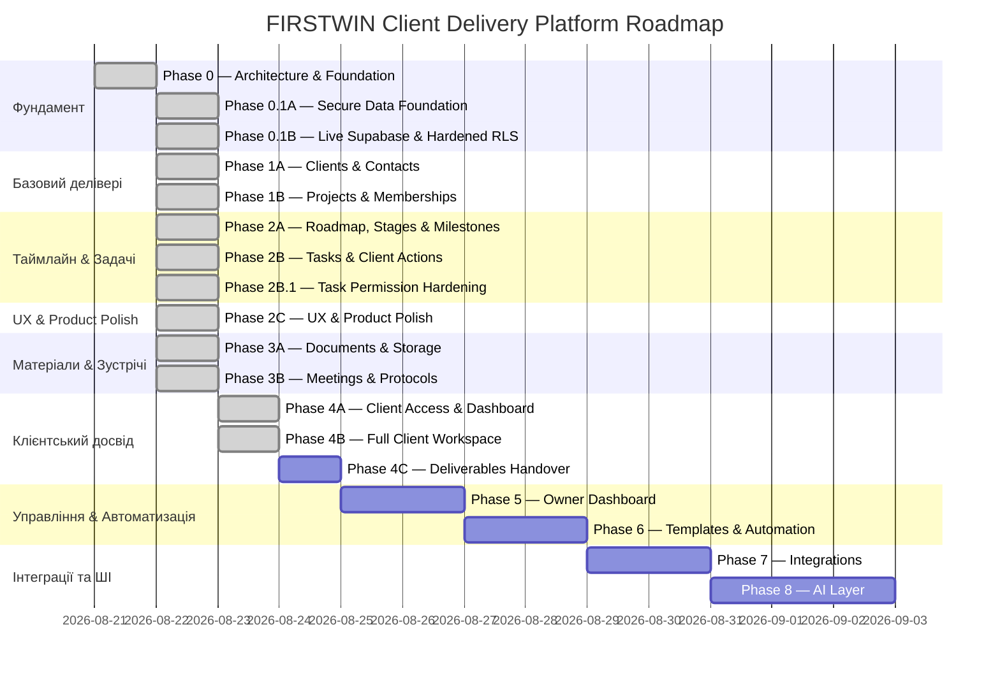

# Client & Project Delivery Platform — Roadmap

> **Platform**: FIRSTWIN Client Delivery Ecosystem  
> **Approach**: Поетапне ітеративне впровадження (Phase-by-Phase)  
> **Status**: Phase 0, 0.1A, 0.1B, 1A, 1B, 2A, 2B, 2B.1, 2C, 3A, 3B, 4A, 4A.1, 4A.2, 4B Completed  
> **Last Updated**: 2026-08-23  

---

## 📌 Загальний план реалізації (Overview of Phases)

---

## 📋 Деталізація фаз

### 🔹 Phase 0 — Architecture & Foundation *(Завершено)*
- [x] Аналіз кодової бази FIRSTWIN.
- [x] Документація в `/docs/client-portal/`.
- [x] Затвердження повного продуктового ТЗ (`PRODUCT_SPEC.md`).

### 🔹 Phase 0.1A & 0.1B — Secure Data Foundation *(Завершено)*
- [x] Створення модульної структури `js/portal/`.
- [x] Міграція `20260822000001_phase0_1a_foundation.sql`.
- [x] Membership-модель та RLS-політики.

### 🔹 Phase 1A — Portal Shell, Clients & Contacts *(Завершено)*
- [x] Екран авторизації з відновленням пароля та OTP (`#/portal`).
- [x] Таблиця організацій / клієнтів (`#/portal/clients`).
- [x] Картка клієнта з табами Огляд та Контакти (`#/portal/clients/:id`).

### 🔹 Phase 1B — Projects & Memberships *(Завершено)*
- [x] Реєстр проєктів делівері `#/portal/projects`.
- [x] Паспорт проєкту `#/portal/projects/:id` з управлінням командою.

### 🔹 Phase 2A — Roadmap, Project Stages & Milestones *(Завершено)*
- [x] Таблиці `project_stages` та `milestones`.
- [x] Інтерактивний Stage View делівері проєкту.
- [x] Детермінований розрахунок прогресу.

### 🔹 Phase 2B & 2B.1 — Tasks, Dependencies & Actions *(Завершено)*
- [x] Таблиці `tasks` та `task_dependencies`.
- [x] Project Tasks: List View та Kanban дошка.
- [x] Робочий простір "Мої задачі" (`#/portal/tasks`).

### 🔹 Phase 2C — UX & Product Polish *(Завершено)*
- [x] Ізоляція Portal Layout від публічного Website.
- [x] Повна локалізація UI labels українською мовою.

### 🔹 Phase 3A & 3B — Documents, Versioning & Meetings *(Завершено)*
- [x] Приватний Supabase Storage бакет `project-documents`.
- [x] Версіонування документів, signed URLs.
- [x] Зустрічі, адженди, протоколи, рішення та Action Items.

### 🔹 Phase 4A — Client Access, Invitations, Auth & Dashboard *(Завершено)*
- [x] Таблиця `client_portal_access` та Edge Function `client-access-admin`.
- [x] Керування доступом клієнтів в Internal Portal.
- [x] Client Workspace (`#/client/*`) та Client Dashboard (`#/client/dashboard`).

### 🔹 Phase 4B — Full Client Project Workspace, Roadmap, Action Center, Review & Approvals, Meetings *(Завершено)*
- [x] SQL-міграція `20260823000010_client_workspace_phase4b.sql` (публікація версій `is_client_visible`, таблиця `document_review_events`, захищені RPC `approve_document_version`, `request_document_changes`, `publish_document_version`).
- [x] Stale Approval Protection (заборона погодження/запиту правок на застарілу версію, якщо вже опублікована новіша).
- [x] Обов'язковість непустого коментаря при запиті змін до документа.
- [x] Client Workspace Routing: `#/client/projects`, `#/client/projects/:id`, `#/client/actions`, `#/client/documents`, `#/client/documents/:id`, `#/client/meetings`, `#/client/meetings/:id`.
- [x] Client Project Detail з 5 табами (Огляд, Дорожня карта, Очікуємо від вас, Документи, Зустрічі).
- [x] Client Roadmap: тільки клієнтські етапи та точки, підтверджений розрахунок прогресу або статус «Дорожня карта готується».
- [x] Action Center: фільтри (Активні, Прострочені, Виконані, Всі), миттєве виконання/повернення задачі через RPC, модальне вікно деталей.
- [x] Document Review & Approval UI: завантаження опублікованих файлів, CTA «Погодити документ» та «Запросити правки» з модальним вікном, аудит-лог рішень.
- [x] Client-Safe Meetings Workspace & Detail: порядок денний, безпечна проєкція учасників, клієнтські нотатки, зафіксовані рішення та матеріали.
- [x] Internal Portal Document Detail: секція «Погодження клієнта» та кнопки публікації окремих версій.
- [x] 100% проходження `test_phase4b_security.js` (24/24 перевірки) та `test_phase4a_security.js` (0 регресій).

---

### 🔹 Phase 4C — Client Deliverables Handover & Sign-off *(Наступний етап)*
**Мета**: Фінальна передача артефактів проєкту клієнту, підписання актів / закриття делівері, інтерактивна форма зворотного зв'язку (NPS / CSAT).

---

### 🔹 Phase 5A — Owner Command Center & Portfolio Dashboard *(Завершено)*
- [x] Внутрішній оперативний дашборд `#/portal/dashboard` для Owner/Admin.
- [x] 6 KPI карток портфеля (Активні клієнти, Активні проєкти, У зоні ризику, Прострочені задачі, Очікуємо дій клієнтів, Погодження документів).
- [x] Таблиця Portfolio Health з 5 табами фільтрації, пошуком, фільтрами за клієнтом та PM.
- [x] Attention Center з табами критичності (Критичні, Високі, Увага) для негайного операційного реагування.
- [x] Срізи навантаження команди (`Team Workload`), найближчих зустрічей та дій клієнтів.
- [x] 100% проходження `test_phase5a_security.js` (13/13) та browser verifications.

### 🔹 Phase 5B — Notifications, Personal Inbox & Proactive Control *(Завершено)*
- [x] SQL-міграція `20260824000011_notifications_personal_inbox_phase5b.sql` (таблиця `notifications`, строгий RLS `recipient_user_id = auth.uid()`, RPC `mark_notification_as_read`, `mark_all_notifications_as_read`, `get_unread_notifications_count`).
- [x] Ідемпотентний детермінований евалюатор `evaluate_notifications()` з унікальними ключами `dedupe_key`.
- [x] Тригери нотифікацій на завдання, проєкти та погодження документів.
- [x] Header Bell кнопка з динамічним бейджем непрочитаних сповіщень та випадаючим вікном (flyout dropdown).
- [x] Повноцінний Центр сповіщень `#/portal/notifications` з KPI лічильниками, 8 фільтрами за категоріями, пошуком та груповими діями.
- [x] Компактний віджет «Нові сповіщення» у головному дашборді `#/portal/dashboard`.
- [x] 100% проходження `test_phase5b_security.js` (17/17) та Chromium verification suite (0 console errors).

---

### 🔹 Phase 5C.1 — Finance Foundation, Project Economics & Payment Tracking *(ЗАВЕРШЕНО)*
**Мета**: Контроль вартості контрактів, комерційних умов, графіків оплат, отриманих коштів, прострочень та внутрішніх витрат (Owner-only).
- [x] SQL-міграція `20260824000013_finance_foundation_phase5c1.sql` (`project_commercial_terms`, `project_payment_schedule`, `project_payments`, `project_costs`, `finance_audit_events`).
- [x] Цілочисельна архітектура сум у мінорних одиницях (`amount_minor BIGINT`) + мультивалютне групування без автоматичної конвертації.
- [x] Тригер авто-розрахунку стану траншів `handle_payment_mutation()`, блокування overpayment та append-only захист `prevent_finance_audit_tampering()`.
- [x] Рольова безпека: Owner — Full CRUD, PM — Commercial terms & Payments по своїх організаціях (Costs & Margin strictly denied), Specialist & Client — Default Deny.
- [x] Робочий простір «Фінанси» у паспорті проєкту (`#/portal/projects/:id` → tab «Фінанси») з KPI Header, картками комерційних умов, графіку оплат, історії платежів та блоком внутрішніх витрат для Owner.
- [x] Фінансовий центр портфеля `#/portal/finance` з мультивалютними агрегованими картками, пошуком, фільтрами та таблицею економіки.
- [x] Компактний віджет «Фінансовий стан» на головному дашборді `#/portal/dashboard`.
- [x] Нотифікації `payment_due_soon`, `payment_overdue` та `payment_received`.
- [x] 100% проходження тестів: `test_phase5c1_security.js` (24/24), `test_phase5c1_calculations.js` (18/18), browser suite (0 console errors).

---

### 🔹 Phase 5C.2 — Portfolio Analytics & Health Trends *(Наступна фаза — очікує старту)*
**Мета**: Аналітика делівері портфеля, тренди здоров'я та звітність за період.

---

### 🔹 Phase 6 — Templates & Automation (Шаблони та Автоматизація)
**Мета**: Прискорити запуск нових проєктів за рахунок типових процесів.

---

### 🔹 Phase 7 — Integrations (Інтеграції)
**Мета**: Зв'язати платформу з зовнішніми сервісами.

---

### 🔹 Phase 8 — AI Layer (ШІ-помічник для делівері)
**Мета**: Скоротити рутину та підвищити якість комунікації.
