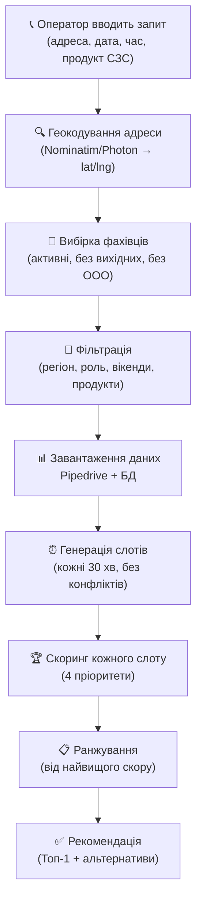

# Логіка призначення замірів по відділу СЗС (МЗП)

## Загальний потік

Коли оператор кол-центру вводить дані клієнта (адреса, дата, час, тип продукції "СЗС"), система проходить наступні етапи:



---

## Етап 1: Вибірка та фільтрація фахівців

Система бере **всіх активних** фахівців і залишає тільки тих, хто:

| Перевірка | Деталі |
|-----------|--------|
| **Регіон збігається** | Лівий/Правий берег, Київська обл., Одеса тощо |
| **Не має вихідного** | Перевірка в локальній БД (DayOff) |
| **Не в OOO** | Перевірка в Pipedrive (відпустка, лікарняний) |
| **Роль підходить** | Для СЗС: `measurer` + `designer` + `universal` |
| **Продуктова спроможність** | Чи може фахівець міряти обрані продукти (напр. Свистун не міряє москітні сітки) |
| **Вікенди** | Якщо дата — вихідний, фахівець має працювати по вихідних |

### Хто бере участь для СЗС?

**Замірники (measurer):** Юрасов, Коломієць, Самусєв, Свистун, Гіренко, Березка, Куліков, Шилюк та інші

**Дизайнери-універсали (designer):** Бєляєва, Бойко-Ромашкіна, Малянова, Курилова, Москович, Нагорна, Славна, Леонтенко, Рибченко, Славгородська та інші

> [!NOTE]
> Для СЗС **обидві категорії** фахівців беруть участь у скорингу на рівних умовах.

---

## Етап 2: Генерація слотів

Для кожного фахівця генеруються **слоти по 30 хвилин** протягом робочого дня:

- Стандартний робочий день: **09:00–18:00**
- Якщо є CUSTOM_HOURS — використовуються індивідуальні години
- Тривалість заміру СЗС: **30 хв** (стандарт) або **60 хв** (великий)
- **Мінімальний буфер**: 30 хвилин між замірами

Слоти, що конфліктують з існуючими замірами в Pipedrive, **автоматично виключаються**.

---

## Етап 3: Скоринг (4 пріоритети)

Кожен слот отримує **бальну оцінку**. Чим більше балів — тим вище в рекомендації.

### 🥇 Пріоритет 1 — ЛОГІСТИКА (домінантний фактор)

> *«Будь-який замір спочатку визначається до якого фахівця ближче»*

**Якщо у фахівця вже є заміри цього дня:**

Система рахує відстань від **адреси нового заміру** до **попереднього/наступного заміру** фахівця через реальні маршрути (OSRM):

| Час в дорозі | Бали | Мітка |
|-------------|------|-------|
| ≤ 15 хв | **+200** | Дуже близько |
| 16–30 хв | **+120** | Близько |
| 31–45 хв | **+60** | Середня відстань |
| > 45 хв | **-30** | Далеко |

**Якщо у фахівця немає замірів цього дня:**

Система рахує відстань від **адреси заміру** до **району виїзду** фахівця (homeLat/homeLng):

| Час в дорозі | Бали | Мітка |
|-------------|------|-------|
| ≤ 15 хв | **+80** | Дуже близько до району |
| 16–30 хв | **+50** | Близько |
| 31–45 хв | **+25** | Середня відстань |
| > 45 хв | **-10** | Далеко від району |

> [!IMPORTANT]
> **Свистун Олена** — без авто. Для неї час в дорозі розраховується як **громадський транспорт** (driving time × 1.8). Наприклад, якщо на авто 20 хв, для Свистун це буде ~36 хв.

### 🥈 Пріоритет 2 — МІСЯЧНА КВОТА СЗС (тільки для дизайнерів)

> *«На кожного дизайнера максимум 2 заміри по СЗС на робочу зміну на місяць»*

Система перевіряє **дизайнерів** (не замірників):

- **Місячний ліміт**: `кількість_робочих_днів × 2` замірів СЗС
- **Тижневий ліміт**: `25%` від загального тижневого обсягу замірів

Якщо норма перевищена → **-500 балів** (фактично виключає дизайнера з рекомендації)

```
Приклад: Липень 2026, 23 робочих дні
→ Ліміт на дизайнера: 23 × 2 = 46 замірів СЗС/місяць
→ Тижневий ліміт: 25% від загального обсягу тижня
```

> [!NOTE]
> **Замірники** (Юрасов, Коломієць, Самусєв, Свистун) — **не мають квоти** по СЗС. Вони можуть мати необмежену кількість замірів.

### 🥉 Пріоритет 3 — ВІЛЬНИЙ ЗАМІРНИК

> *«Якщо є замірники без замірів у цей день — пріоритет замірнику»*

Якщо фахівець має роль `measurer` **і** в цей день у нього **0 замірів** → **+100 балів**

```
Приклад: 15 липня, Юрасов без замірів → +100
         Коломієць має 2 заміри → +0 (бонус не діє)
```

### 🏅 Пріоритет 4 — РАЙОН ВИЇЗДУ

> *«Замір логістично ближче до району замірника»*

Це враховується через Пріоритет 1 (логістику), коли у фахівця **немає замірів** — порівнюється відстань до його домашнього району:

| Фахівець | Район | Координати |
|----------|-------|-----------|
| Юрасов Денис | просп. Європейського Союзу | 50.5056, 30.4103 |
| Коломієць Руслан | просп. Алішера Навоі | 50.4818, 30.6013 |
| Самусєв Микита | Васильків | 50.1771, 30.3196 |
| Свистун Олена | Голосіївський р-н | 50.3733, 30.4594 |

---

## Додаткові фактори скорингу

Крім 4 пріоритетів, система також враховує:

| Фактор | Бали | Коли |
|--------|------|------|
| **Навантаження 0 замірів** | +60 | Перший замір на день |
| **Навантаження 1 замір** | +40 | Низьке навантаження |
| **Навантаження 2 заміри** | +20 | Помірне |
| **Навантаження 3+ заміри** | -5 | Підвищене |
| **Навантаження 4+ замірів** | -20 | Високе (⚠️ HIGH risk) |
| **Великий проміжок між замірами** | +10..+30 | Вільний час ≥60 хв |
| **Точний збіг часу клієнта** | +70 | startTime збігається |
| **Слот в вікні клієнта** | +40 | Всередині бажаного часу |
| **Поза бажаним часом** | -40 і більше | Слот далеко від бажаного |
| **Вечірній час (16:00+)** | -10 | Можливі затори |
| **Недостатньо часу на дорогу** | -15 | Фізично не встигне доїхати |

---

## Приклад розрахунку

```
📍 Клієнт: вул. Ревуцького 40, Лівий берег, 15 липня, 14:00
📦 Продукт: рулонні штори (СЗС)

Фахівець              | Логістика | Квота | Вільний | Час    | Навант. | СКОР
──────────────────────────────────────────────────────────────────────────────
Юрасов (замірник)      | +200      |  —    | +100    | +70    | +60     | 430
  ↳ 0 замірів, район 8 хв від Ревуцького
Коломієць (замірник)   | +120      |  —    | +0      | +70    | +40     | 230
  ↳ 1 замір, попередній замір 25 хв
Славна (дизайнер)      | +60       | ok    | —       | +70    | +20     | 150
  ↳ 2 заміри, попередній замір 40 хв
Свистун (замірник,🚌)  | +50       |  —    | +100    | +70    | +60     | 280
  ↳ 0 замірів, район 20 хв ГТ від Ревуцького
Бєляєва (дизайнер)     | +200      | -500  | —       | +70    | +60     | -170
  ↳ Квота перевищена!

🏆 Рекомендація: Юрасов 14:00 (скор 430)
📋 Альтернативи: Свистун 14:00 (280), Коломієць 14:00 (230)
```

---

## Транспортний режим

| Фахівець | Транспорт | Як рахується час |
|----------|-----------|-----------------|
| Юрасов | 🚗 Авто | OSRM driving route |
| Коломієць | 🚗 Авто | OSRM driving route |
| Самусєв | 🚗 Авто | OSRM driving route |
| **Свистун** | **🚌 ГТ** | **driving × 1.8** (мін. 15 хв) |
| Усі дизайнери | 🚗 Авто з водієм | OSRM driving route |
